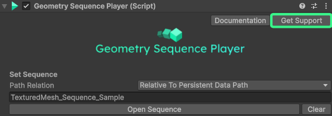

#### ⭐ Priority support (Unity Asset Store version)

If you've bought the package on the Unity Asset Store, you can always contact us to get help quickly! Please click on the **Get Support** button inside the **Geometry Sequence Player component** to see how to contact us! 

#### General support

For the open-source and free version, please feel free to ask anything in our:

[Unity Forums thread](https://forum.unity.com/threads/released-geometry-sequence-streaming.1453765/).

Bugs and issues can also be reported [here in the main Github repository](https://github.com/BuildingVolumes/Unity_Geometry_Sequence_Player/issues) 🪲

>💡 Do a quick search first, if your issue has already been reported. If not, please open a new one, and we'll get back to you!
