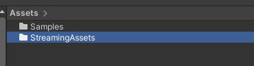
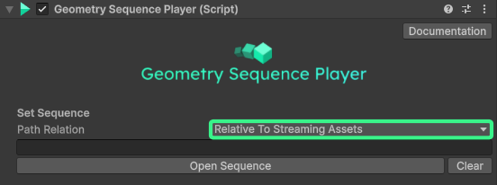

## Build and ship

If you intent to distribute your Application built with the Unity Geometry Sequence Player, you need to consider where you store your geometry sequence.
In Unity, you need to store all assets loaded at runtime in a [**Streamingassets**](https://docs.unity3d.com/Manual/StreamingAssets.html) folder ([except for Android Builds](#android)), located inside of the Asset path root, and store all geometry sequences in there. This folder will be copied into your build as-is.

1. Inside of the Unity project view, go to the "Assets" folder and create a **Streamingsassets** folder there:

    

2. Copy all your geometry sequences into this folder

3. In your Geometry Sequence Player, either set the sequence via **Open Sequence** and then choose the folder inside of your streamingassets path *or* set the **Path Relation** to **Relative to Streamingassets** and then enter the path to your sequence, relative to the Streamingassets folder:

    

4. Test your changes and path in play mode, then you can build and distribute your application as usual.

## Android

On Android, the StreamingAssets path is a special case. Data stored into this path, will be compressed into the .apk and needs to be decompressed on load. For large files, like geometry sequences, this will make a noticeable impact on playback performance, therefore we don't support the Streamingassets path. On Android, you have to use the applications [**Persistent Data Path**](https://docs.unity3d.com/ScriptReference/Application-persistentDataPath.html). The persistent data path is a special path, reserved for application data on the device. Unlike the StreamingAssets path, Unity won't copy your files automatically to the persistent data path, instead, you have to **copy them manually**, or on distribution in the Play Store, let your application download them from a server.

> ⚠️The persistent data path will only be generated on the applications first run on the device. So you need to run the application once, then copy the files and then run the application again, or let the app download the files onto the device before the Geometry Sequence Player runs.

1. Inside of your Geometry Sequence Player, set the **Path Relation** to **Relative to Persistent Data Path** and enter the relative path in which you later want to store your sequence, in this example we choose *"Sequence/MySequence"*.

    

2. Build the android app, install it on your Android device and run it, then quit the app. The Geometry Sequence won't be playing at this point.

3. Connect your device to your PC via USB, enable File transfer and then go to the following path on the device:
*"\Android\data\com.myCompanyName.myProductName\files"*. This is your applications **Persistent Data Path**.

4. Copy your sequence files in the same relative path you set in the Geometry Sequence Player. In our example, the geometry files would be copied into this folder *"\Android\data\com.myCompanyName.myProductName\files\Sequence\MySequence"*

5. Now run your app again, you should now see the sequence streaming successfully.

## Apple Vision Pro

Unity Apps can run in three distinct modes on the Apple Vision Pro: A **flat 2D mode**, where apps appear on a virtual screen, the **bounded mode**, and the **immersive mode**.
All modes are supported by this plugin. While the **flat mode** runs like an IPhone or IPad application, there are stark differences between the **bounded** and **immersive** mode.
We generally recommended to use the **immersive** mode whenever you can, due to it's much higher performance capabilities.

### Bounded mode

The bounded mode lets the users run an app along other apps, inside a limited volume, comparable to a 3D window. Apps running in this mode face many restrictions, including not being able to render their content natively. Unity needs to translate all meshes, textures, materials and shaders to RealityKit equivalents, this is called the **PolySpatial** pipeline. Due to these restrictions, playback performance suffers and works only for smaller sequences. Pointclouds sequences should stay under **50.000 points per frame**, mesh sequences under **30.000 polygons per frame**, and textures at or under **2048x2048 texture resolution** per frame. Additionally, there might be a performance ditch when the sequence starts, especially for pointcloud sequences. These are gradually streamed in to not overload the system.

Bounded mode should be detected automatically by the package. If it does not work and you get playback errors while running on the device, you need to have a volume camera component inside your scene.

> ☝️ Due to some lower level code in this package, the playback might not work correctly in the AVP simulator

### Immersive mode

Immersive mode lets the application take over the full rendering on the Apple Vision Pro, which is much more comparable to how apps are run on other headsets, such as the Meta Quest. While no other content than the application can exist in the same space, this mode **increases performance** by a huge margin compared to the bounded mode. We were able to run sequences with 1.5 millions points per frame and more! Please ensure that **no volume camera exists** in your scene if you use this mode, otherwise the bounded rendering path might get erroneously activated by the package.
