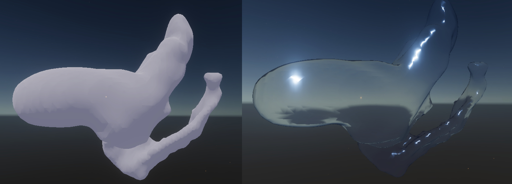
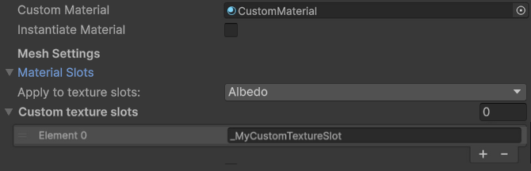
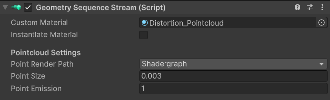
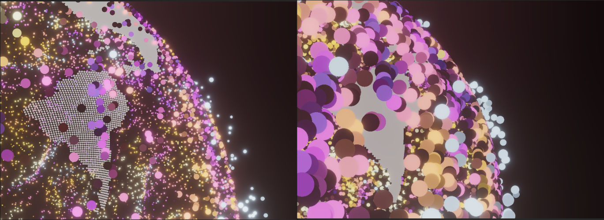
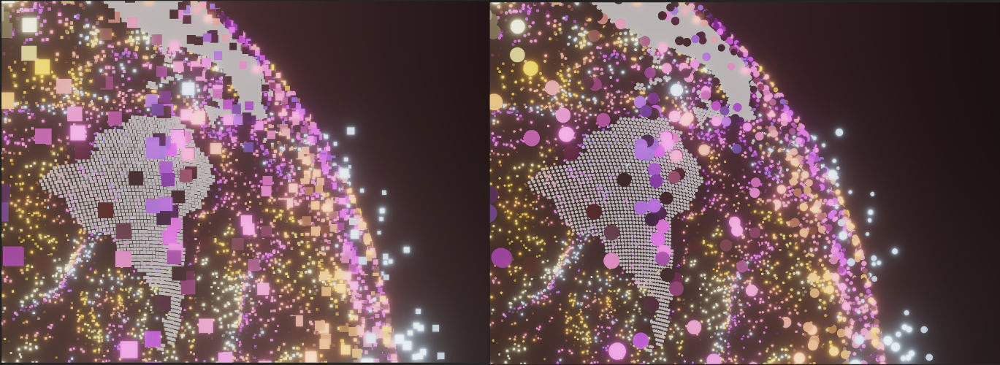
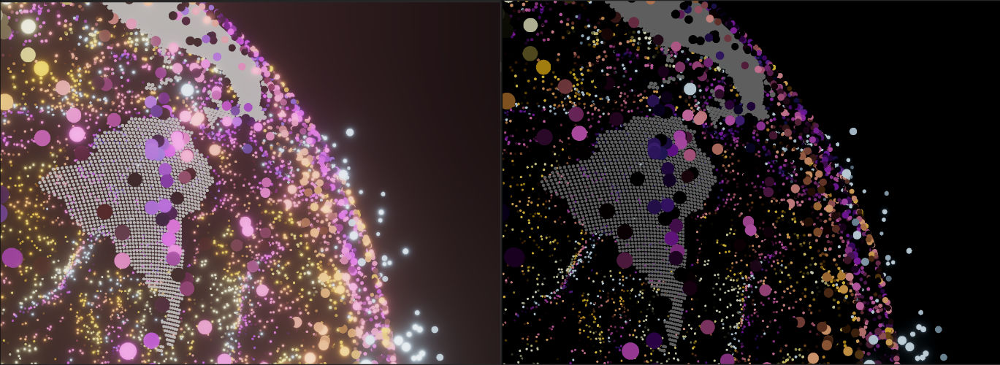

## Intro

To enhance the look of your sequence, you can use your own custom Materials and Shaders. You don't have to assign a material for every new sequence, the package will load a default material automatically, but they give you more control over the look and appearance.

## Mesh sequences

### Assigning materials

Assigning a material to a mesh sequence works just like for every other mesh in Unity. Create your material, but then instead of assigning it in the mesh renderer directly, you have to go to the **Geometry Sequence Stream** component that can be found on the same Gameobject as your _Geometry Sequence Player_. Under **Mesh settings** you can find the **Mesh Material** slot, where you can assign your material.

> ☝️ Please note that  the sequence thumbnail in the editor might not always be updated automatically. Sometimes you need to enter the playmode once so that changes are visible.

### Texture slot assignment

If you have a mesh sequence with textures, you can also control into which shader slot the texture will be applied. By default, the texture will always be applied to the Main/Albedo/Diffuse texture slot, which is defined in the shader as _\_MainTexture_. But you can also apply the texture to any other slot. Either you select one or more predefined slot in the **Apply to texture slots** variable, or you enter the name of the texture slot into the **Custom texture slots** list. This has to be the name of the texture slot as found in the shader, not the material! (Shader texture slot variables are often prefixed with an _Underscore).

## Pointcloud sequences

The appearances of the pointclouds are a more difficult to change, as they require special shaders to display the pointclouds correctly. However, there are some predefined settings you can use to easily and quickly change pointcloud rendering. These settings can be found under the **Geometry Sequence Stream** component.

### Pointcloud size

With the pointcloud size parameter, you control the size of each point in Unity units. Usually 0.01 - 0.02 is a good range for most sequences.

### Pointcloud shape

The pointcloud shape let's you switch between different point rendering options. There are **Quads**, **Circles** and **Splats (Experimental)**. Quads are the default and look like pixels. For a softer look, circles are a good choice, but you might need to adjust the size a bit. Splats are half-transparent circles, which give the softest look, but they are not yet fully implemented and will look strange most of the time.

### Pointcloud emission

The pointcloud material is emissive by default, to give a look similar to an unlit material. You can disable the emission by setting this value to 0, or turn it up higher to give the points a glowing ember appearance. You need to enable bloom in your URP/HDRP volume settings to get the full effect.

### (Advanced) Changing the shader

You can also directly edit the Pointcloud shaders to more finely tune the appearance of the points. You need some experience with writing shaders for Unity though! You can find the shaders under:

´Packages > Geometry Sequence Player > Runtime > Shader > Resources´

You'll see two different sets of shaders, three shaders written in Shaderlab, and three ShaderGraphs, with a _RT suffix. The Shadergraph shaders are at the moment only used when the Polyspatial/Bounded rendering path of the Apple Vision Pro is used, otherwise the Shaderlab Shaders will be used
