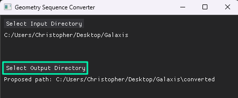
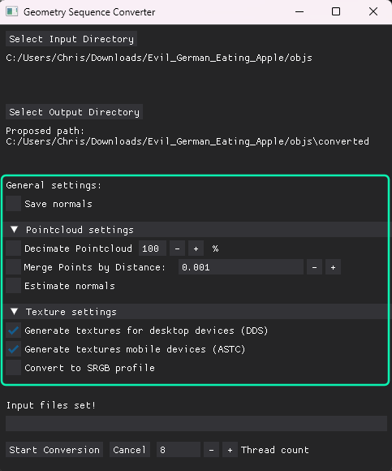

## Intro

To guarantee high realtime performance, the Geometry Sequence Player can only read sequences that are in a certain file format (.ply for meshes/pointclouds, .dds/.astc for textures). However, to support a broad spectrum of input formats and make the usage of this plugin as easy as possible, we provide a small converter tool which takes in almost all widely used mesh and image formats, and converts them into the correct format for the plugin.

> 👉🏻 Even when your files are already in the .ply/.dds format, they might need to be run through the converter to be encoded correctly!
>
> ⤴️ Sequences that were created before package version 1.1.0 are not compatible with the current package. Please re-convert these files with the latest Converter

## Preparation for the conversion

### Naming

In general, you should export your animated mesh or pointcloud sequences from your tool of choice in a way, that each frame of it is saved in a single, independent file. The files should be numbered in some kind of ascending order. This applies to both your models and also textures, if you have any. Save all files into one folder, without subfolders. Example:

```txt
  frame_1.obj
  frame_2.obj
  frame_3.obj
  ...

  frame_00001.obj
  frame_00002.obj
  frame_00003.obj
  ...

  1_image.png
  2_image.png
  3_image.png
  ...
```

Ensure that the matching images and models for each frame have the same number!

### Supported file formats

The format in which you export your sequence shouldn't matter too much, as a wide variety of the most commonly used formats is supported.
These are all supported file formats for pointclouds/meshes:

```txt
.3ds .asc .bre .ctm .dae .e57 .es .fbx .glb .gltf .obj .off .pdb .ply .pts .ptx .qobj .stl .tri vmi .wrl .x3d .xyz
```

And for images:

```txt
.jpg .png .tga
```

## Converting your sequences

### Installing the converter

1. Download the latest version of the [converter tool from here](https://github.com/BuildingVolumes/Unity_Geometry_Sequence_Player/releases). (File named "Geometry_Sequence_Converter_Win64.zip") Currently only windows is supported.
2. Unpack the file
3. Windows might show you a warning screen. You can click on ***More info*** and then ***Run anyways***
4. Open the converter. Go into the unpacked folder and open "GeometrySequenceConverter.exe". Windows might throw a warning that it prevented the app from running, in this case click on "Run anyway" or "More info" and then "Run anyway".

### Using the converter

1. Click on ***Select Input Directory*** and select the folder containing the files.


2. You can now optionally choose an output directory. If you don't choose one, a folder named *converted* will be created inside your sequence directory.


3. The converter provides some settings which can be used to modify the sequence:


- **Save normals:** When enabled, the normals of the mesh or pointcloud sequence are exported. Only recommended to enable if you have custom normals
- **Pointcloud Settings:** Only affects pointclouds
  - **Decimate Pointcloud:** You can downsize your pointcloud sequence with this option. The value determines the percentage of points left after conversion. E.g. setting the value to 30% will decrease the points of the sequence by 70%.
  - **Merge Points by Distance:** Merges points that are close together. The higher the value, the more points will be merged. Useful if the data contains duplicated points
  - **Estimate Normals:** Pointclouds usually don't come with normals. When this option is enabled, the normals will be reasonably estimated.
- **Texture Settings** Only affects mesh sequences with textures
  - **Generate textures for desktop devices (DDS):** This converts the textures into a format for desktop GPUs. Recommended to leave on, even when you only build for mobile devices, otherwise textures won't show up in the Unity editor.
  - **Generate textures for mobile devices (ASTC):** If you plan to distribute your application on mobile devices (Android, IPhone, Meta Quest, Apple Vision Pro) and use textured meshes, you need to also generate .astc textures. You only need to transfer the .astc textures to your device, but not the .dds textures.
  - **Convert to SRGB profile:** Activate when your textures look noticably darker / brighter after the conversion

4. When you've set your input/output folders, click on ***Start Conversion***. You can optionally choose the amount of threads used for the conversion, which might come in handy for heavy/large sequences. 

5. The converter will now process your files and show a progress bar. If you want to cancel the process, click on ***Cancel***. Cancelling might take a bit of time. When the process is done, you'll have the converted sequence inside of the output folder.

## For developers: Format specification

If you want to export your data into the correct format directly, without using the converter, you can do so! The format used here is not proprietory, but uses the open [*Stanford Polygon File Format* (.ply)](http://paulbourke.net/dataformats/ply/ ) for meshes and pointclouds and the [*DirectDraw Surface* (.dds)*](https://en.wikipedia.org/wiki/DirectDraw_Surface), as well as [*Adaptive Scalable texture compression*](https://en.wikipedia.org/wiki/Adaptive_scalable_texture_compression) file format for textures/images. However, all formats allow a large variety of encoding settings, and the Geometry Sequence Player expects a special encoding. Additionally, the Player needs to be supplied with a ***sequence.json*** file, which contains metadata about the sequence. The following sections assume that you are a bit familiar with all formats.

### Pointcloud .ply files

For .ply files containing pointclouds, use the normal **little endian binary** .ply standard, but be sure to encode the **vertex positions and normals as 32-bit floats** (not doubles), and use the **vertex colors as uchar RGBA**. You always need to provide the red, green, blue and alpha channel, even when your sequence doesn't use alpha values or colors at all. Normals are optional, and don't have to be used. Here is an example of how the header of a ply looks that is correctly formatted:

```ply
ply
format binary_little_endian 1.0
comment How the header of a correctly formated .ply file with a pointcloud looks like
element vertex 50000
property float x
property float y
property float z
property float nx
property float ny
property float nz
property uchar red
property uchar green
property uchar blue
property uchar alpha
end_header
```

As an example for how the data for a a single vertex (line) could look like this. Three float position values are followed by another three normal floats and four RGBA byte/uchar values:

```ply
0.323434 0.55133 1.44322 0.65453 0.23645 0.65372 255 255 255 0 
```

### Mesh .ply files

For .ply files containing meshes, you use the same **little endian binary** format as for the pointclouds, with the **vertex positions encoded as 32-bit floats**. Encode the **face indices as a uchar uint list**, as it is commonly done in the ply format. Only encode **faces as triangles**, so the uchar component of the face indices list should always be "3". Optionally, you can also supplement **per vertex normals** with the nx, ny and nz properties.
If you want to use textures/UV-coordinates, include the **U and V-coordinates as additional float propertys (property s and property t)** right behind the xyz properties.
An example header of a correctly formatted mesh ply file with UV-coordinates would look like this:

```ply
ply
format binary_little_endian 1.0
comment Exported for use in Unity Geometry Streaming Plugin
element vertex 73200
property float x
property float y
property float z
property float nx
property float ny
property float nz
property float s
property float t
element face 138844
property list uchar uint vertex_indices
end_header
```

The data for a single vertex (line) would look like this. Three vertex position floats, followed by three vertex normal floats and two float values for the UV-coordinates:

```ply
0.323434 0.55133 1.44322 0.65453 0.23645 0.65372 0.231286 0.692901
```

The data for a single indice (line) in the index list could look like this. The indice list is appended after the vertex list:

```ply
3 56542 56543 56544
```

### Textures/Images

The textures should be encoded with **BC1/DXT1** encoding and **no mip-maps** for the *.dds format* and the **6x6 blocks** and **linear LDR color profile** for .astc textures. Please ensure that the resolution and encoding stays consistent for all textures in one sequence.

### Sequence.json

The sequence.json file contains information about your sequence in the following format and should be saved in the sequence folder:

```JSON

//This is an example sequence.json for a textured mesh sequence with
//three frames

{
  "geometryType": 2, //0 = Pointcloud, 1 = Mesh, 2 = Textured Mesh
  "textureMode": 2, //0 = No Textures, 1 = One texture, 2 = Per Frame textures
  "DDS": true, //Does this sequence have .dds textures?
  "ASTC": false, //Does this sequence have .astc textures?
  "hasUVs": true, //If using a mesh, does it have UVs?
  "hasNormals": false, //Are per-vertex normals used?
  "maxVertexCount": 26545, //The vertice count of the mesh/pointcloud with the highest vertice count in the whole sequence
  "maxIndiceCount": 55423, //The indice count of the mesh/pointcloud with the highest indice count in the whole sequence
  "maxBounds": [325.8575134277344, 295.0, 2103.5478515625, -18.240554809570312, -238.74757385253906, 0], //Bounds of the mesh in the format: MaxboundX, MaxboundY, MaxboundZ, MinboundX, MinboundY, MinboundZ
  "textureWidth": 512, //The width of the texture(s)
  "textureHeight": 512, //The hight of the texture(s)
  "textureSizeDDS": 2097152, //The size of a single .dds texture in bytes
  "textureSizeASTC": 0, //The size of a single .astc texture in bytes
  "headerSizes": [260, 260, 260], //The size of the .ply header in bytes, for each frame
  "verticeCounts": [25434, 26545, 24554], //The vertice counts of each frame
  "indiceCounts": [55423, 54543, 45443] //The indice counts of each frame
  }
```
