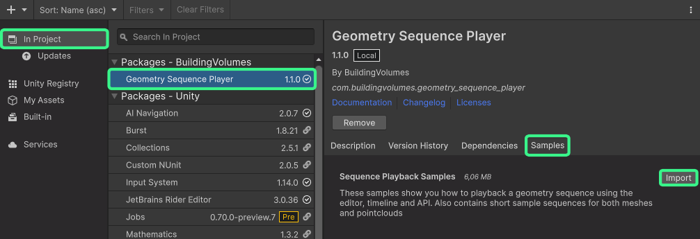
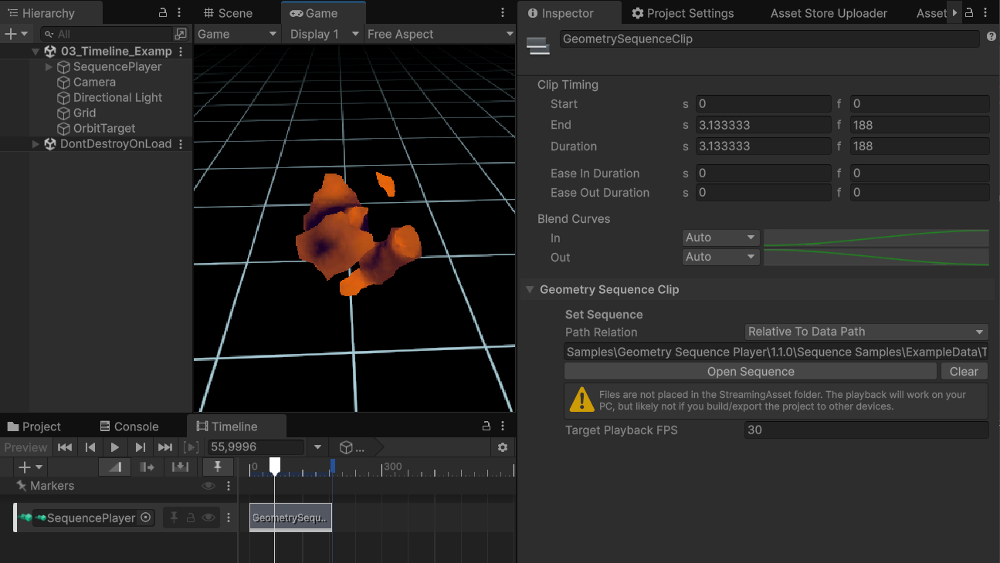
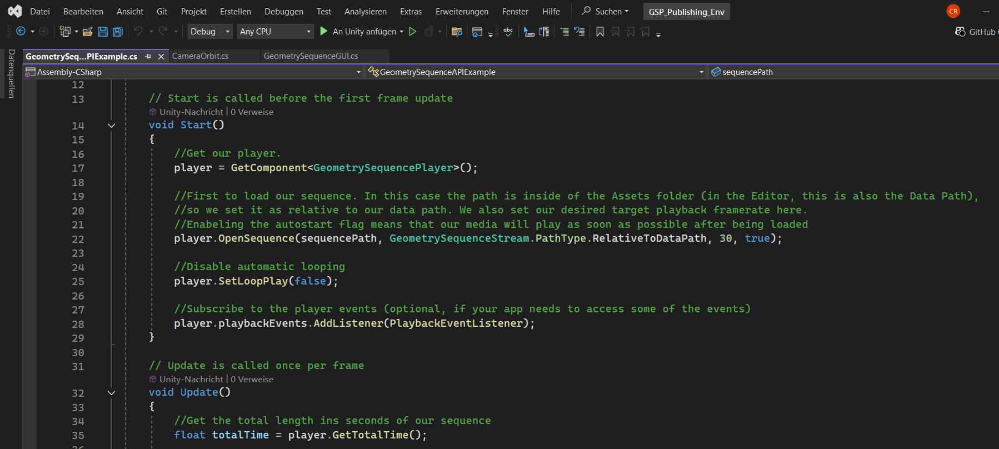
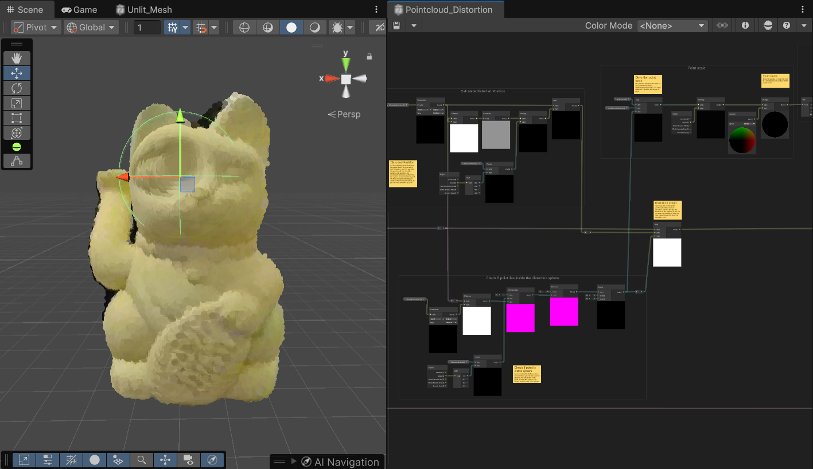

The samples contain demo scenes, that you can refer to for how to set up your own scenes and playback your own sequences. If you've never used the plugin before, we highly recommend to take a look at the samples!

## Importing the samples

As this package is distributed as a UPM package, you need to install the samples into your projects first:

1: Open the Package Manager from **Window -> Package Manager**

2: Click on **In Project** on the left side of the window, and then select the **Geometry Sequence Player** package.

 > ⭐ For the Unity Asset Store version, two versions of the Geometry Sequence Player package will appear in the list. One under "Packages - Asset Store" and one under "Packages - BuildingVolumes". You need to select the **Building Volumes** version.

3: Click on the **Samples** tab to the right

4: **Import** the Sequence Samples. They will now be installed in your projects Asset Directory in the **Assets -> Samples** folder.

You can now open the sample scenes to take a look how [mesh playback](#sample-01-basic-playback), [pointcloud playback](#sample-02-pointcloud-playback), [timeline playback](#sample-03-timeline-playback) and the [scripting API](#sample-04-scripting-api) works.

## Samples

### Sample 01: Basic Playback

This scene contains a simple mesh sequence with per frame textures. When you open the scene, you should see a static 3D thumbnail of the first frame of the sequence in the editor viewport. Press Play in Unity to enter the game mode and start playback of the sequence. In the game window, you can move the camera around the sequence by clicking and holding the left mouse button and moving the mouse, and zoom with the scrollwheel. The scene setup includes:

- A Gameobject **Sequence Player** which contains the **Geometry Sequence Player** and **Geometry Sequence Stream** components neccessary for playback
- The **path to the sequence** has already been added to the **Geometry Sequence Player** component
- The **Play at start** and **Loop** options have been enabled in the **Geometry Sequence Player** component

You can inspect the sequence that has been used at:

`Assets\Samples\Geometry Sequence Player\1.1.0\Sequence Samples\ExampleData\TexturedMesh_Sequence_Sample`

> Try playing around with the media controls on the **Geometry Sequence Player** component

[More info](/Unity_Geometry_Sequence_Player/docs/tutorials/playback/)

### Sample 02: Pointcloud Playback

The pointcloud playback sample is identical in setup to the basic playback scene, the only difference is that a **pointcloud sequence** instead of a mesh sequence has been used.

You can inspect the sequence at:

`Assets\Samples\Geometry Sequence Player\1.1.0\Sequence Samples\ExampleData\Pointcloud_Sequence_Sample`

> Try changing the **point size** and **point type** options on the **Geometry Sequence Stream** component

[More info](/Unity_Geometry_Sequence_Player/docs/tutorials/playback/)

### Sample 03: Timeline Playback

This scene shows how to setup and control sequence playback from the Unity Timeline. Open the Unity timeline window and select the **Sequence Player** to see how the timeline is setup. Press the **Play** Button to go into game mode and see the timeline playback in action. The scene contains:

- A Gameobject **Sequence Player** which contains a **Geometry Sequence Stream** component (**but not a Geometry Sequence Player** component!)
- This gameobject also contains a **Playable Director** component, to which the timeline is attached (the playable director is automatically added when a new Timeline asset is created from the timeline window)
- A **Geometry Sequence Track** has been added to the timeline, and the **Sequence Player** Gameobject has been assigned to the track
- A **Geometry Sequence Clip** was added to the **Geometry Sequence Track**. The sample mesh sequence from the [basic playback sample](#sample-01-basic-playback) is being used in this clip

> Try adding the pointcloud sequence to the timeline, so that it plays after the mesh sequence has finished

[More info](/Unity_Geometry_Sequence_Player/docs/tutorials/timeline-integration/)

### Sample 04: Scripting API

This scene is mostly identical to the [basic playback scene](#sample-01-basic-playback), but the **Sequence Player** Gameobject additionally contains the **Geometry Sequence API Example** script, which shows how to use the Scripting API for playback control and how to listen to playback events. The script is well-commented, so we recommend to read it to see how the playback API works. Press **Play** to enter the game mode. The sequence should play halfway three times before stopping, just as programmed in the script.

[More info](/Unity_Geometry_Sequence_Player/docs/tutorials/scripting-api/)

### Sample 05: Shadergraph

> ⚠️ You need to have the shadergraph package installed in your project for this example to work

Try to grab the DistortionSphere object in the scene, move it around and watch how it affects the cat!

This scene demonstrates how a custom shadergraph can be used to modify pointcloud sequences. While shaders for mesh sequences work just like they would for any other mesh in Unity, pointclouds differ a lot. They render each point on a different plane, and therefore need some special pre-requesites in the shader to fully work. The Shadergraph sample shows how such a custom shadergraph could work, and how to modifiy the position and scale of points.

To start, open up the Shadergraph at:

`Assets\Samples\Geometry Sequence Player\1.2.0\Sequence Samples\ExampleData\ExtraAssets\Shaders\DistortionShader.shadergraph`

and take a look at the comments there to get an understanding of what makes the shader work. It is strongly recommended to get a basic graps of shader and shadergraph concepts first!

[More info](/Unity_Geometry_Sequence_Player/docs/tutorials/materials/)
