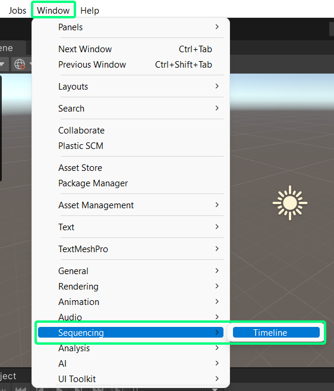
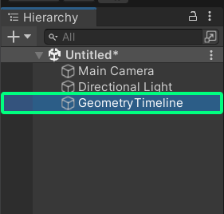
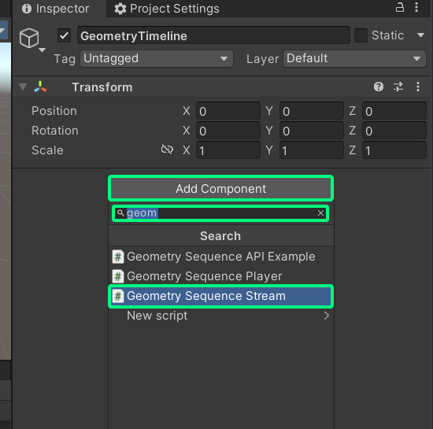
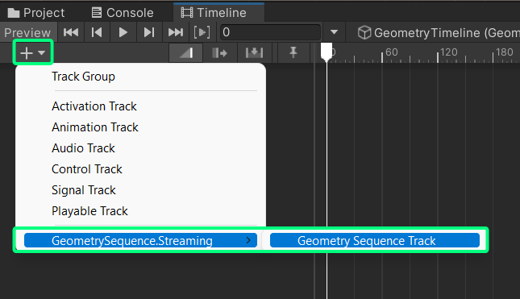
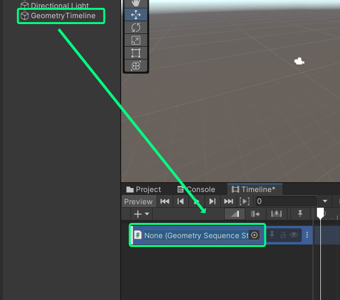
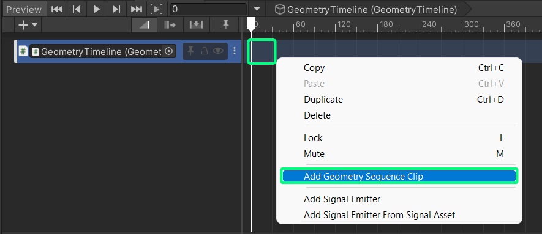

## Intro

> 💡 All of the features explained here in this tutorial can also be found in the Sample Scene [02_Timeline_Example](/docs/tutorials/unity-package-installation/#importing-the-samples-optional)

For playback scenarios, where a precise control of the playback, or cohesive animation with other objects is needed, the package also supports the playback from the Unity Timeline.

## Setting up a timeline clip

1. Open the timeline window by going to **Window --> Sequencing --> Timeline** in the main toolbar 

2. Create a new empty gameobject, or select the one you want to attach the timeline to. 

3. Add a **"Geometry Sequence Stream"** component to the gameobject.
    > ⚠️ Check that there is no "Geometry Sequence Player" component attached to the gameobject, when you use the Geometry Sequence Stream component for timeline playback!

    

4. Go into the Timeline window and click on **Create**. Save the timeline director file anywhere in your assets folder. 

5. Add a geometry sequence track by clicking on the **"+"-Button** in the top left corner. Click on **GeomeotrySequence.Streaming --> Geometry Sequence Track** 

6. Drag and drop the gameobject that contains your Geometry Sequence Stream component into the empty field on the track 

7. Right-click anywhere on the empty track field and add a clip by clicking on **Geometry Sequence Clip** 

8. With the new clip still selected, go into the inspector and click on **Open Sequence**. Choose the folder, where your converted sequence is stored in. 

9. Due to a missing feature in Unity, the clip doesn't auto-adjust it's length, so the clip might be (a lot) shorter or longer than it actually is. Adjust the duration of the clip manually by dragging on it's end cap, or set the duration in the inspector. 

10. Done! The clip will only playback when you're in play mode, so if you want to see your sequence, you need to go into it first.

11. You can now add more clips on the same track, or play two clips at the same time, by adding a **second Geometry Sequence Stream** component, and assigning it to a second track.
