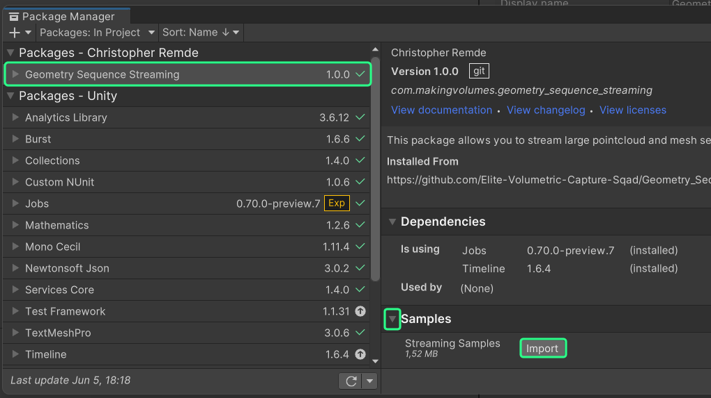

> 👉🏻 Make sure that your Unity project is using Unity 2020.1 or above, versions below are not supported!

## Package Installation

1. Open your Unity project, and in the toolbar, go to **Windows --> Package Manager**

2. In the Package Manager window, go into the upper left corner and click on the **"+" Button --> Add package from Git URL** 

3. Copy and paste the following URL and click **Add**: `https://github.com/BuildingVolumes/Geometry_Sequence_Streaming_Package.git` 

4. Unity now installs the package, and after a short time it should show up in your manager. Done! We strongly recommend that you also install the **Samples 👇🏻**

## Importing the samples (optional)

The samples contain a short demo sequence and some scenes, that you can refer to for how to set up your own scenes and playback your own sequences.
If you've never used the plugin before, we strongly recommend to take a look at the samples!

To install the samples, **select** the Geometry Streaming Sequence and open the **Sample foldout**. Then click on **import**. 

The sample data is now in your Unity assets folder. You can open the sample scenes to take a look how *basic playback*, *timeline playback* and the *scripting API* works.
If you run any of the samples in play mode, you should see a box spinning! If it doesn't, please report an issue!

