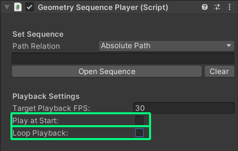

> 💡 All of the features explained here in this tutorial can also be found in the Sample Scene [03_API_Example](/docs/tutorials/installation/#importing-the-samples-optional)

## Intro

Beside playback from timeline and in the editor, this package also allows you to control playback from your own scripts. This is useful, if you have for example playback control by the user via UI buttons, or you want interactivly integrate playback inside your application.

## Setup

To use the Scripting API, you need to have a gameobject in the scene that has the **Geometry Sequence Player** and **Geometry Sequence Stream** components attached to it.

First, include the BuildingVolumes namespace inside your script with:

```C#
using BuildingVolumes.Streaming;
```

In your script, you then have to get the **Geometry Sequence Player** component, ideally directly in the start function:

```C#
void Start()
    {
        //Get our player.
        player = GetComponent<GeometrySequencePlayer>();
    }
```

Then, we recommend that you disable **Play at Start** and **Loop Playback** either directly through the editor inside of the **Geometry Sequence Player** component:



or via script inside of the start function. This ensures that you have full control over when and how you want to play your sequence.

```C#
void Start()
    {
        //Get our player.
        player = GetComponent<GeometrySequencePlayer>();

        //Disable automatic looping and automatic playback.
        player.SetLoopPlay(false);
        player.SetAutoStart(false);
    }
```

You can the load your sequence with the **LoadSequence** function at any point:

```C#
//Load our sequence, set its framerate to 30 and play it directly after loading
player.LoadSequence("C:\MySequences\MyOwnSequence\", GeometrySequencePlayer.PathType.AbsolutePath, 30, true);
```

For more functions and precise playback control, please take a look below 👇🏻

## Scripting Reference

`LoadSequence(string path, PathType relativeTo, float playbackFPS , (optional) bool autoplay)`
Load a .ply sequence (and optionally textures) from the path, and start playback if autoplay is enabled.
Parameters:

- `path`: The relative or absolute path to the folder containing the directory. Should end with a slash
- `relativeTo`: Is the path relative to the [data path](https://docs.unity3d.com/ScriptReference/Application-dataPath.htmls), [streaming assets path](https://docs.unity3d.com/Manual/StreamingAssets.html), or is it an absolute path?
- `playbackFPS`: The framerate in which your animated sequence was exported in.
- `autoplay` : Optional parameter, if set to true, playback starts directly after it has been loaded

Returns:

- **True** when sequence could successfully be loaded, **false** when an error has occured while loading. Take a look in the Unity console in this case

`void Play()`
Start Playback from the current location.

`void Pause()`
Pause current playback

`void SetLoopPlay(bool enabled)`
Activate or deactivate looped playback
Parameters:

- `enabled` : Set to true/false to enable/disable looped playback

`void SetAutoStart(bool enabled)`
Activate or deactivate automatic playback (when the scene starts)
Parameters:

- `enabled` : Set to true/false to enable/disable automatic playback when the scene has started

`bool PlayFromStart()`
Seeks to the start of the sequence and then starts playback
Returns:

- `True`, when the sequence could be started from the beginning `False` when there has been an error.

`bool GoToFrame(int frame)`
Goes to a specific frame. Use GetTotalFrames() to check how many frames the clip contains
Parameters:

- `enabled`

Returns:

- `True` when skipping was successfull `False` if there has been an error, or the desired frame index was out of range

`void GoToTime(float timeInSeconds)`
Goes to a specific time in  a clip. The time is dependent on the framerate e.g. the same clip at 30 FPS is twice as long as at 60 FPS.
Parameters:

- `timeInSeconds` : The desired timestamp of the sequence to which you want to jump.

`string GetSequencePath()`
Gets the absolute path to the folder containing the sequence
Returns:

- The absolute path to the Sequence currently used

`bool IsPlaying()`
Is the current clip playing?
Returns:

- `True` if the clip is playing `False` if it is paused, stopped or not loaded

`bool GetLoopingEnabled()`
Is looped playback enabled?
Returns:

- `True` if the playback is enabled `False` if it is disabled

`int GetCurrentFrameIndex()`
At which frame is the playback currently?
Returns:

- The frame index which is currently being played/shown

`float GetCurrentTime()`
At which time is the playback currently in seconds?
Note that the time is dependent on the framerate e.g. the same clip at 30 FPS is twice as long as at 60 FPS.
Returns:

- The current timestamp of the clip in seconds

`int GetTotalFrames()`
How many frames are there in total in the whole sequence?
Returns:

- The total number of frames in the sequence

`float GetTotalTime()`
How long is the sequence in total?
Note that the time is dependent on the framerate e.g. the same clip at 30 FPS is twice as long as at 60 FPS.
Returns:

- The length of the sequence in seconds

`float GetTargetFPS()`
The target fps is the framerate we _want_ to achieve in playback. However, this is not guranteed, if system resources
are too low. Use GetActualFPS() to see if you actually achieve this framerate
Returns:

- The playback framerate used currently for this clip

`float GetActualFPS()`
What is the actual current playback framerate? If the framerate is much lower than the target framerate,
consider reducing the complexity of your sequence, and don't forget to disable any V-Sync (VSync, FreeSync, GSync) methods!
Returns:

- The actual FPS at which your sequence is playing.

`bool GetFrameDropped()`
Check if there have been framedrops since you last checked this function. You should pull this data every frame.
Too many framedrops mean the system can't keep up with the playback
and you should reduce your Geometric complexity or framerate.
Returns:

- `True` When there has been a frame dropped since the last time you checked it, `False` if there has been no framedrop
